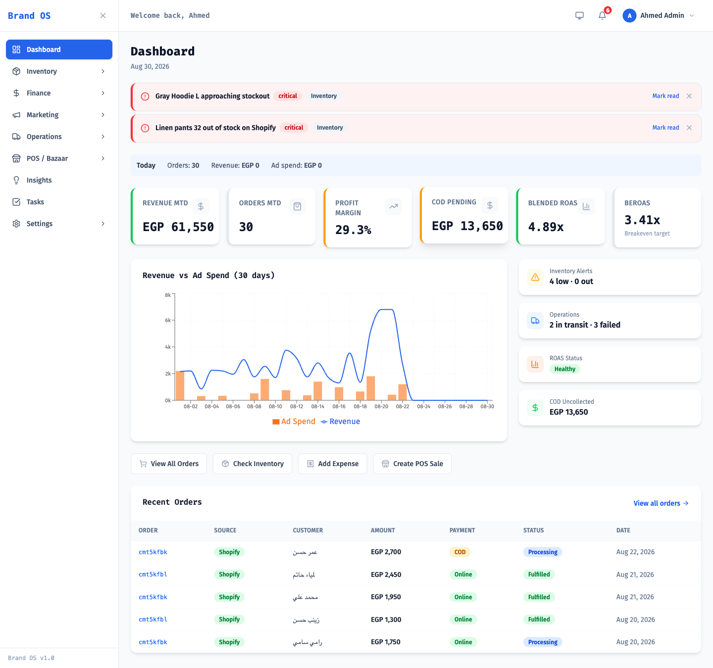
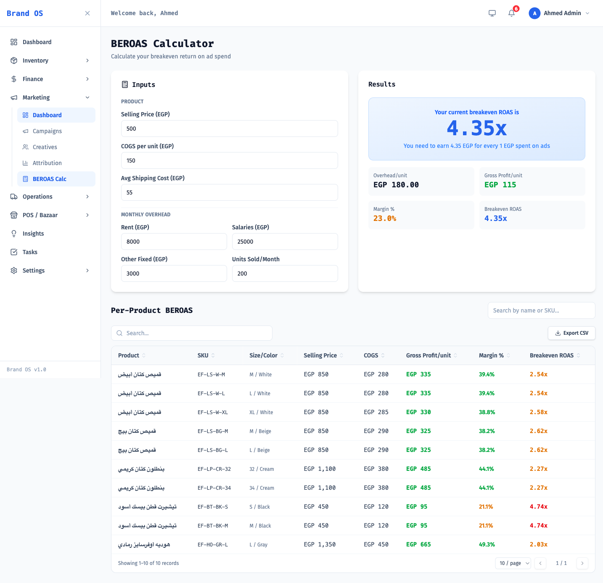
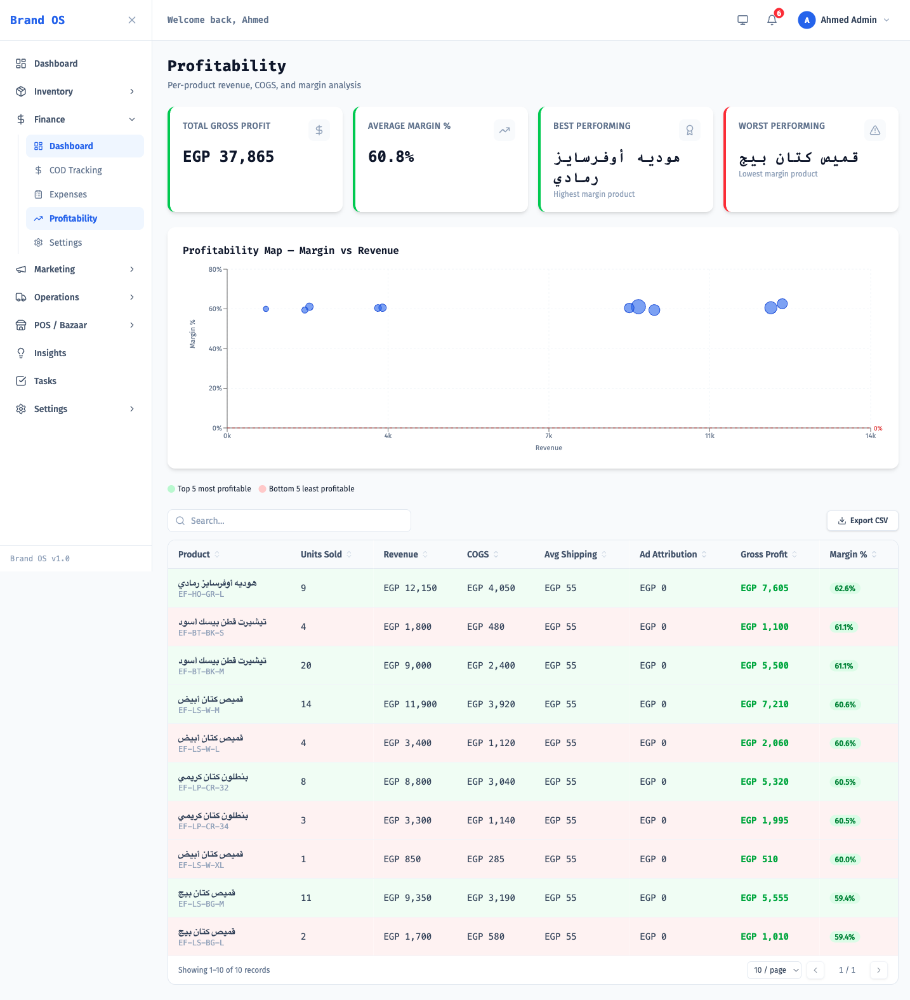
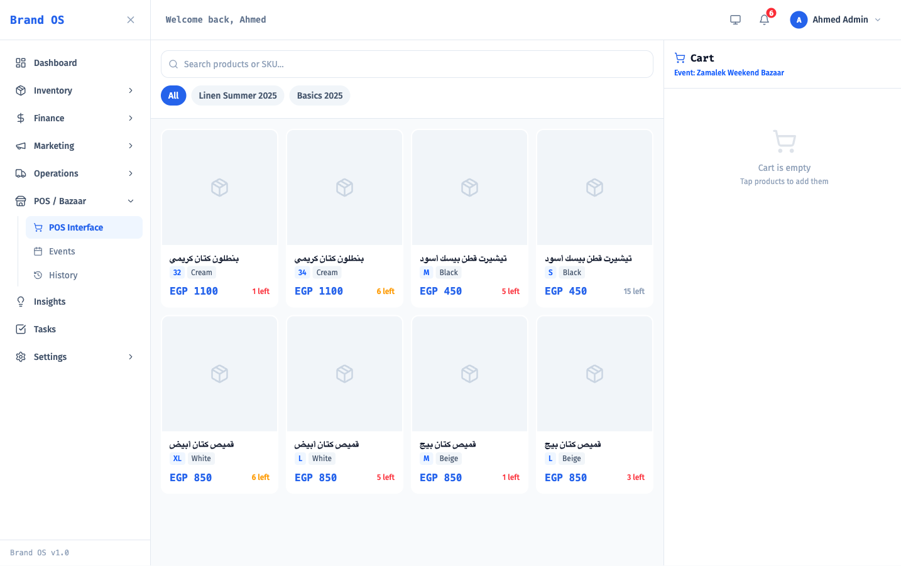

<h1 align="center">Brand OS</h1>

<p align="center">
  <strong>Open-source e-commerce brand operations platform — profitability, break-even ROAS, inventory, COD logistics and offline POS in one dashboard.</strong>
</p>

<p align="center">
  <a href="https://azzazy967.github.io/brandos/"><strong>Website</strong></a> &nbsp;&middot;&nbsp;
  <a href="docs/INSTALL.md"><strong>Install guide</strong></a> &nbsp;&middot;&nbsp;
  <a href="https://github.com/azzazy967/brandos/releases/latest"><strong>Releases</strong></a>
</p>

<p align="center">
  <a href="#license"></a>
  
  
  
  
  
</p>

---

**Brand OS** is a self-hosted operations dashboard for direct-to-consumer (D2C) and Shopify brands. It joins your **store orders, ad spend, shipping costs and overheads** into a single source of truth, so you can answer the only question that matters: *is this product actually making money?*

Most analytics tools report revenue. Brand OS reports **profit** — after COGS, after shipping, after failed cash-on-delivery deliveries, after rent and salaries. It then converts that margin into a **break-even ROAS (BEROAS)** target per product, so your media buyer knows the exact number to beat before a campaign burns cash.

Built for markets where cash-on-delivery, high return rates and offline bazaar sales are the norm — not an afterthought.

## Table of contents

- [Features](#features)
- [Screenshots](#screenshots)
- [Tech stack](#tech-stack)
- [Quick start](#quick-start)
- [Installation](#installation)
- [Configuration](#configuration)
- [Architecture](#architecture)
- [API reference](#api-reference)
- [How break-even ROAS is calculated](#how-break-even-roas-is-calculated)
- [Integrations](#integrations)
- [Roadmap](#roadmap)
- [Contributing](#contributing)
- [Security](#security)
- [License](#license)

## Features

| Module | What it does |
|---|---|
| **Profitability** | True net margin per product and per order — COGS, shipping, ad spend, returns and overhead allocation included. |
| **BEROAS calculator** | Per-product and blended break-even ROAS targets, with healthy / warning / critical status against actual ROAS. |
| **Finance** | Expense tracking, overhead settings (rent, salaries, other), monthly P&L, and **cash-on-delivery reconciliation**. |
| **Inventory** | Stock levels, restock planner, product detail with unit economics, and size-level demand intelligence. |
| **Marketing** | Campaign performance, creative-level metrics, and attribution across paid channels. |
| **Operations** | Order lifecycle, returns, and **failed-delivery tracking** — the silent margin killer in COD markets. |
| **Offline POS** | Point-of-sale for bazaars, pop-ups and events: cart, checkout, per-event inventory and settlement history. |
| **AI insights** | Claude-generated narrative insights over your own operational data. |
| **Tasks & team** | Task board plus role-based access control for owners, managers and staff. |

## Screenshots

### Dashboard

Month-to-date revenue, orders and true profit margin alongside blended ROAS measured against its break-even target — so a campaign's health is a computed verdict, not a vibe.



### Break-even ROAS calculator

Per-product break-even targets derived from real unit economics — COGS, shipping and allocated overhead — not a guessed margin.



### Profitability

Net margin per product after COGS, shipping and ad attribution, with a margin-vs-revenue map that separates the products worth scaling from the ones quietly losing money.



### Offline POS for bazaars and pop-ups

Sell at events against the same inventory, with per-event stock and settlement history.



## Tech stack

**Frontend** — React 19, TypeScript, Vite 6, Tailwind CSS 4, Radix UI, Recharts, Zustand, React Router 7
**Backend** — Node.js 22, Express, Prisma 6, PostgreSQL 16, Redis 7, BullMQ, JWT auth, Zod validation, Helmet
**AI** — Anthropic Claude via `@anthropic-ai/sdk`
**Infrastructure** — Docker Compose, nginx

## Quick start

The fastest path is Docker Compose — it brings up PostgreSQL, Redis, the API and the web app together.

```bash
git clone https://github.com/azzazy967/brandos.git
cd brandos

# Generate the three required secrets
cat > .env <<EOT
POSTGRES_PASSWORD=$(openssl rand -hex 16)
JWT_SECRET=$(openssl rand -hex 32)
ENCRYPTION_KEY=$(openssl rand -hex 32)
CORS_ORIGIN=http://localhost:3001
EOT

docker compose up -d --build

# Apply the schema and load demo data
docker compose exec backend npx prisma db push
docker compose exec backend npx tsx prisma/seed.ts
```

Open **http://localhost:3001** and sign in with the seeded account:

| Email | Password |
|---|---|
| `admin@brandos.eg` | `pass123` |

> Change or delete the seeded account before exposing the app to anyone else.

Full instructions, including running without Docker, are in **[docs/INSTALL.md](docs/INSTALL.md)**.

## Installation

See the **[installation guide](docs/INSTALL.md)** for:

- Docker Compose deployment (recommended)
- Local development without Docker
- Database migrations and seeding
- Production deployment behind nginx
- Upgrading and troubleshooting

## Configuration

All backend configuration is environment-driven. Copy the template and fill it in:

```bash
cp backend/.env.example backend/.env
```

| Variable | Required | Description |
|---|---|---|
| `DATABASE_URL` | yes | PostgreSQL connection string. |
| `JWT_SECRET` | yes | Signing key for session tokens. Use 32+ random bytes. |
| `ENCRYPTION_KEY` | yes | AES-256 key used to encrypt stored integration credentials. |
| `REDIS_URL` | yes | Redis connection string for the BullMQ job queue. |
| `CORS_ORIGIN` | yes | Origin allowed to call the API, e.g. `http://localhost:5173`. |
| `PORT` | no | API port. Defaults to `4000`. |
| `ANTHROPIC_API_KEY` | no | Enables AI insights. The rest of the app works without it. |
| `ARAMEX_WEBHOOK_SECRET` | no | Verifies incoming Aramex delivery webhooks. |

Never commit a real `.env`. It is already listed in `.gitignore`.

## Architecture

```
brandos/
├── backend/              Express + Prisma API
│   ├── prisma/           Schema, migrations, seed data
│   └── src/
│       ├── routes/       One router per domain (finance, marketing, pos, …)
│       ├── lib/          Business logic — BEROAS, profitability, encryption
│       └── middleware/   Auth, RBAC, rate limiting
├── frontend/             React + Vite SPA
│   └── src/
│       ├── pages/        Route-level screens, grouped by module
│       ├── components/   Reusable UI built on Radix + Tailwind
│       └── stores/       Zustand client state
├── design-system/        Design tokens and per-page design rules
└── docker-compose.yml    Postgres + Redis + API + web
```

The web app is served by nginx, which reverse-proxies `/api/` to the backend container — so the browser only ever talks to one origin.

## API reference

All routes are mounted under `/api` and require a `Bearer` token except `/api/auth/*` and `/api/webhooks/*`.

| Route | Purpose |
|---|---|
| `POST /api/auth/register`, `POST /api/auth/login` | Account creation and sign-in (rate limited). |
| `GET /api/dashboard` | Top-level KPIs. |
| `GET /api/beroas/calculate` | Per-product and blended break-even ROAS. |
| `/api/finance` | Expenses, overheads, COD reconciliation, P&L. |
| `/api/inventory` | Products, stock levels, restock planning. |
| `/api/marketing` | Campaigns, creatives, attribution. |
| `/api/operations` | Orders, returns, failed deliveries. |
| `/api/pos` | Bazaar events, carts, offline sales. |
| `/api/insights` | AI-generated insights. |
| `/api/sync/:type` | Trigger a sync job (`shopify`, `orders`, `products`, `inventory`, `marketing`). |
| `/api/webhooks/aramex`, `/api/webhooks/bosta` | Signed carrier delivery-status callbacks. |
| `/api/settings`, `/api/brand`, `/api/users`, `/api/tasks` | Configuration, integrations, team and task management. |

## How break-even ROAS is calculated

Break-even ROAS is the ad return you need just to avoid losing money on a sale. Brand OS derives it from real unit economics rather than a guessed margin:

```
overheadPerUnit = (monthlyRent + monthlySalaries + otherMonthly) / unitsSoldThisMonth
grossProfit     = sellingPrice - cogs - avgShippingCost - overheadPerUnit
margin          = grossProfit / sellingPrice
BEROAS          = 1 / margin
```

A product at a 25% net margin needs a **4.0x ROAS** to break even. Anything below that is a loss, however good the revenue chart looks. Blended BEROAS weights each product's target by its share of revenue.

Actual ROAS is then graded against the target: **healthy** at or above it, **warning** within 10% below, **critical** beyond that.

## Integrations

| Provider | Type | Status |
|---|---|---|
| **Shopify** | Store orders, products, inventory | Sync jobs |
| **Windsor.ai** | Ad spend and marketing metrics | API key |
| **Aramex** | Shipping and delivery status | API + signed webhook |
| **Bosta** | Shipping and delivery status | API + signed webhook |
| **Anthropic Claude** | AI insights | Optional API key |

Integration credentials are encrypted at rest with `ENCRYPTION_KEY` before being stored.

## Roadmap

- Multi-currency support
- Automated bank and payment-gateway reconciliation
- Additional carrier adapters
- Scheduled email digests of margin alerts

Issues and feature requests are welcome — see [Contributing](#contributing).

## Contributing

Contributions are welcome. Read **[CONTRIBUTING.md](CONTRIBUTING.md)** for the development setup, coding conventions and pull request process.

## Security

Found a vulnerability? Please **do not** open a public issue — follow the process in **[SECURITY.md](SECURITY.md)**.

## License

Released under the [MIT License](LICENSE).

---

<sub>**Keywords:** ecommerce dashboard · Shopify profitability · break-even ROAS calculator · BEROAS · D2C analytics · cash on delivery tracking · COD reconciliation · inventory management · point of sale · open source ecommerce analytics · React TypeScript Prisma PostgreSQL</sub>
